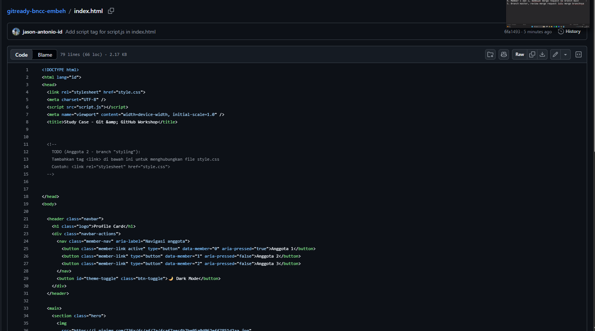

# [Embeh]

Project kolaboratif tim BNCC untuk study case GitReady 2.0 — membangun landing page menggunakan Git & GitHub workflow (branching, Pull Request, code review).

## Visualisasi

atau demo link: [isi kalau ada]

## Tech Stack

- HTML5
- CSS3
- JavaScript

## Fitur Utama

- [Fitur 1, misal: Responsive layout]
- [Fitur 2, misal: Interactive button/animasi dari script.js]
- [Fitur 3]

## Contribution

| Nama | Role | Kontribusi |
|---|---|---|
| Jason Antonio | Project Initiator & Styling Engineer | Setup repository, akses tim |
| Lewis Alvaro | Script Engineer | Interaktivitas JavaScript |
| Catherine Kimberly | Styling Engineer | styling CSS |

## What I Learned

- Cara kerja branching strategy dalam tim
- Resolve merge conflict di file yang sama
- Alur Pull Request dan code review sebelum merge ke main

## Feature Improvement

- Menambahkan responsive design untuk tampilan mobile
- Menambahkan dark mode toggle
- Optimasi animasi/transisi CSS agar lebih smooth
- Menambahkan form validasi menggunakan JavaScript
- Deploy website menggunakan GitHub Pages agar bisa diakses publik
